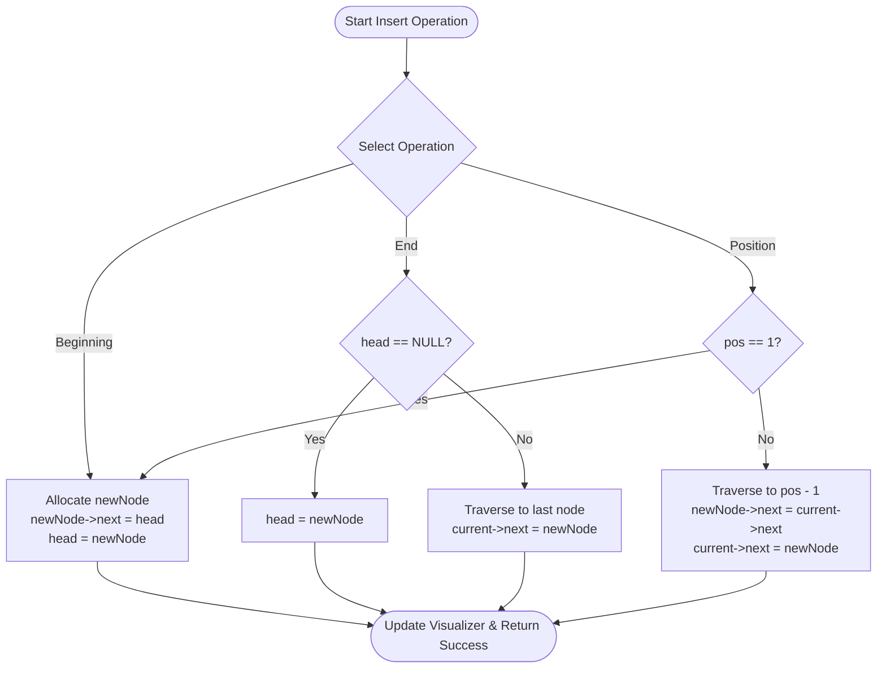
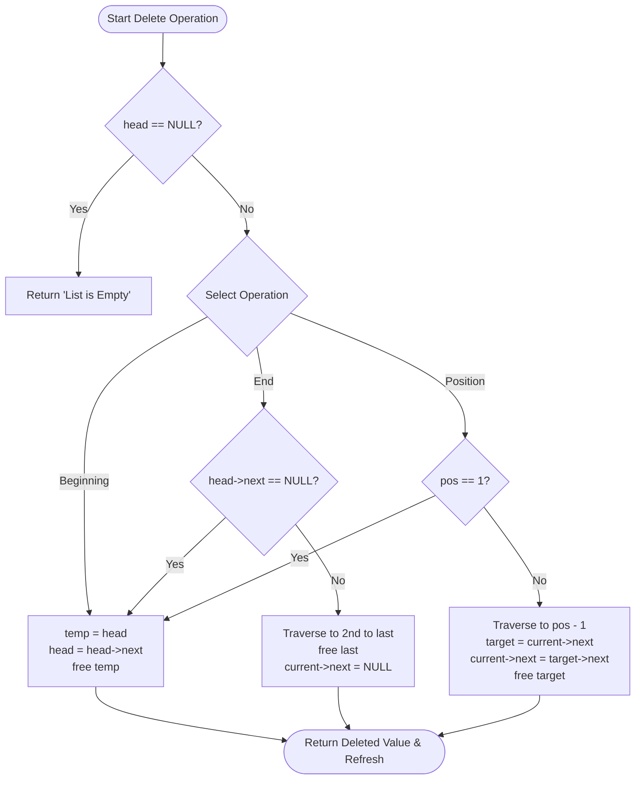

# Singly Linked List Implementation

> **College Mini-Project in Data Structures & Algorithms**  
> A full-stack interactive project featuring a pure **C** singly linked list core, a lightweight cross-platform **C HTTP/REST server**, and a modern responsive **HTML5/CSS3/JavaScript** frontend dashboard.

---

## Table of Contents
1. [Abstract](#abstract)
2. [Introduction](#introduction)
3. [Problem Statement](#problem-statement)
4. [Objectives](#objectives)
5. [Singly Linked List Theory & Architecture](#singly-linked-list-theory--architecture)
6. [Algorithms](#algorithms)
7. [Flowcharts](#flowcharts)
8. [Implemented Operations](#implemented-operations)
9. [Complexity Analysis](#complexity-analysis)
10. [Advantages & Limitations](#advantages--limitations)
11. [Real-World Applications](#real-world-applications)
12. [Future Scope](#future-scope)
13. [Project Directory Structure](#project-directory-structure)
14. [Compilation & Execution Guide](#compilation--execution-guide)
15. [Testing Every Operation](#testing-every-operation)
16. [Git & GitHub Commands](#git--github-commands)
17. [Viva Voce Questions & Answers](#viva-voce-questions--answers)
18. [Conclusion](#conclusion)

---

## Abstract
Dynamic data structures form the backbone of memory-efficient computing systems. While static arrays require contiguous memory allocation and fixed sizes known at compile time, linked lists allocate memory dynamically on the heap on an as-needed basis. This mini-project, titled **“Singly Linked List Implementation”**, demonstrates a complete, end-to-end implementation of a Singly Linked List written in standard **C** (using `struct Node`, explicit pointer manipulation, `malloc()`, and `free()`). To bridge foundational computer science concepts with modern interactive visualization, the C program embeds a lightweight HTTP REST microserver that serves a responsive web dashboard. The web interface visually animates node chains (`HEAD → [10] → [20] → NULL`), supports dynamic insertions, deletions, linear searches, reversal, and memory deallocation, ensuring immediate visual feedback for academic evaluation and self-paced learning.

---

## Introduction
A **Linked List** is a linear data structure where elements are not stored at contiguous memory locations. Instead, each element (commonly referred to as a **Node**) is a standalone block allocated on the heap containing two distinct parts:
1. **Data**: The payload or information to be stored (e.g., an integer value).
2. **Next Pointer (`*next`)**: A memory pointer holding the address of the subsequent node in the sequence.

The first node in the sequence is referenced by a pointer variable named `HEAD`. The final node in the sequence points to `NULL`, designating the boundary of the list.

Unlike arrays, where inserting or deleting elements requires shifting surrounding elements in contiguous memory ($O(n)$ data movement), a linked list achieves insertion and deletion at the beginning in strictly $O(1)$ constant time by merely updating pointer addresses.

---

## Problem Statement
Traditional computer science education frequently introduces linked lists through abstract diagrams or command-line console printouts. Beginners often face difficulties understanding:
- How pointers change address references during insertions and deletions.
- The distinction between passing a pointer by value (`struct Node*`) versus passing by reference (`struct Node**`).
- The hazards of memory leaks (failing to call `free()`) and dangling pointers.
- How backend data structures in compiled languages like C interface with modern graphical user interfaces.

There is a distinct need for a dedicated, single-purpose educational mini-project that focuses strictly on the mechanics of a **Singly Linked List**, avoiding bloated business logic (such as student management systems) and providing real-time visual feedback tied directly to the C memory model.

---

## Objectives
1. Implement a complete Singly Linked List in pure C using `struct Node` and pointer manipulation.
2. Implement dynamic memory allocation (`malloc()`) and deallocation (`free()`) to ensure zero memory leaks.
3. Support all fundamental operations:
   - Create node
   - Insert at beginning ($O(1)$)
   - Insert at end ($O(n)$)
   - Insert at specific position ($O(n)$)
   - Delete from beginning ($O(1)$)
   - Delete from end ($O(n)$)
   - Delete from specific position ($O(n)$)
   - Search for an element ($O(n)$)
   - Count nodes ($O(n)$)
   - Reverse the list in-place ($O(n)$)
   - Clear and deallocate all nodes ($O(n)$)
4. Build a lightweight, cross-platform HTTP microserver in C to expose REST API endpoints.
5. Create a modern, responsive web dashboard with live animated node visual representations (`HEAD → [10] → [20] → NULL`).
6. Deliver clean, modular, and academically documented source code ready for Git version control and college evaluation.

---

## Singly Linked List Theory & Architecture

### Node Anatomy
In C, a singly linked list node is represented using a self-referential structure:
```c
struct Node {
    int data;           /* Data field */
    struct Node *next;  /* Self-referential pointer to next node */
};
```

### Memory Layout
In memory, nodes are allocated arbitrarily in the heap:
```text
  HEAD (Pointer in Stack: points to 0x10A0)
   │
   ▼
┌──────────────┐     ┌──────────────┐     ┌──────────────┐
│ Data: 10     │ ──▶ │ Data: 20     │ ──▶ │ Data: 30     │ ──▶ NULL
│ Next: 0x20B0 │     │ Next: 0x30C0 │     │ Next: NULL   │
└──────────────┘     └──────────────┘     └──────────────┘
  Heap: 0x10A0         Heap: 0x20B0         Heap: 0x30C0
```

---

## Algorithms

### 1. Create Node (`createNode`)
- **Step 1:** Allocate memory of size `sizeof(struct Node)` using `malloc()`.
- **Step 2:** Check if the returned pointer is `NULL` (allocation failure check).
- **Step 3:** Set `newNode->data = data`.
- **Step 4:** Set `newNode->next = NULL`.
- **Step 5:** Return `newNode`.

### 2. Insert at Beginning (`insertBeginning`)
- **Step 1:** Create `newNode` with given value.
- **Step 2:** Set `newNode->next = *head`.
- **Step 3:** Update `*head = newNode`.

### 3. Insert at End (`insertEnd`)
- **Step 1:** Create `newNode` with given value.
- **Step 2:** If `*head == NULL`, set `*head = newNode` and return.
- **Step 3:** Initialize `current = *head`.
- **Step 4:** Traverse while `current->next != NULL`, moving `current = current->next`.
- **Step 5:** Set `current->next = newNode`.

### 4. Insert at Specific Position (`insertAtPosition`)
- **Step 1:** If `position < 1`, return failure (invalid position).
- **Step 2:** If `position == 1`, call `insertBeginning(head, data)` and return success.
- **Step 3:** Initialize `current = *head` and index counter `i = 1`.
- **Step 4:** Traverse while `current != NULL` and `i < position - 1`:
  - `current = current->next`, increment `i`.
- **Step 5:** If `current == NULL`, position is out of bounds; return failure.
- **Step 6:** Create `newNode`, set `newNode->next = current->next`, and `current->next = newNode`. Return success.

### 5. Delete from Beginning (`deleteBeginning`)
- **Step 1:** If `*head == NULL`, list is empty; return failure.
- **Step 2:** Store current head in temporary pointer: `temp = *head`.
- **Step 3:** Save deleted value: `*deletedVal = temp->data`.
- **Step 4:** Advance head: `*head = (*head)->next`.
- **Step 5:** Release memory: `free(temp)`. Return success.

### 6. Delete from End (`deleteEnd`)
- **Step 1:** If `*head == NULL`, list is empty; return failure.
- **Step 2:** If `(*head)->next == NULL` (single node):
  - Store value, `free(*head)`, set `*head = NULL`, return success.
- **Step 3:** Initialize `current = *head`.
- **Step 4:** Traverse while `current->next->next != NULL`:
  - `current = current->next`.
- **Step 5:** Let `last = current->next`. Store `*deletedVal = last->data`.
- **Step 6:** Set `current->next = NULL`.
- **Step 7:** Call `free(last)`. Return success.

### 7. Delete from Specific Position (`deleteAtPosition`)
- **Step 1:** If `*head == NULL` or `position < 1`, return failure.
- **Step 2:** If `position == 1`, call `deleteBeginning(head, deletedVal)`.
- **Step 3:** Initialize `current = *head`, index `i = 1`.
- **Step 4:** Traverse while `current != NULL` and `i < position - 1`:
  - `current = current->next`, increment `i`.
- **Step 5:** If `current == NULL` or `current->next == NULL`, position out of bounds; return failure.
- **Step 6:** Let `target = current->next`.
- **Step 7:** Store `*deletedVal = target->data`.
- **Step 8:** Update links: `current->next = target->next`.
- **Step 9:** Call `free(target)`. Return success.

### 8. Search Node (`searchNode`)
- **Step 1:** Initialize `current = head`, `position = 1`.
- **Step 2:** Traverse while `current != NULL`:
  - If `current->data == key`, return `position`.
  - Else `current = current->next`, `position++`.
- **Step 3:** If end of list reached without finding `key`, return `0`.

### 9. Count Nodes (`countNodes`)
- **Step 1:** Initialize `count = 0`, `current = head`.
- **Step 2:** While `current != NULL`:
  - `count++`, `current = current->next`.
- **Step 3:** Return `count`.

### 10. Reverse List (`reverseList`)
- **Step 1:** Initialize three pointers: `prev = NULL`, `current = *head`, `next = NULL`.
- **Step 2:** While `current != NULL`:
  - `next = current->next` (save next node)
  - `current->next = prev` (reverse pointer direction)
  - `prev = current` (shift prev forward)
  - `current = next` (shift current forward)
- **Step 3:** Set `*head = prev`.

### 11. Clear List (`clearList`)
- **Step 1:** Initialize `current = *head`.
- **Step 2:** While `current != NULL`:
  - `nextNode = current->next`
  - `free(current)`
  - `current = nextNode`
- **Step 3:** Set `*head = NULL`.

---

## Flowcharts

### Insertion Flowchart


### Deletion Flowchart


---

## Implemented Operations

| Operation | C Function | HTTP Route | Payload |
|---|---|---|---|
| **Create Node** | `createNode(val)` | Internal | — |
| **Insert Beginning** | `insertBeginning(&head, val)` | `POST /api/insert/beginning` | `{"value": 10}` |
| **Insert End** | `insertEnd(&head, val)` | `POST /api/insert/end` | `{"value": 50}` |
| **Insert Position** | `insertAtPosition(&head, val, pos)` | `POST /api/insert/position` | `{"value": 25, "position": 2}` |
| **Delete Beginning** | `deleteBeginning(&head, &val)` | `POST /api/delete/beginning` | `{}` |
| **Delete End** | `deleteEnd(&head, &val)` | `POST /api/delete/end` | `{}` |
| **Delete Position** | `deleteAtPosition(&head, pos, &val)`| `POST /api/delete/position` | `{"position": 2}` |
| **Search** | `searchNode(head, val)` | `POST /api/search` | `{"value": 20}` |
| **Count Nodes** | `countNodes(head)` | `GET /api/count` | — |
| **Reverse List** | `reverseList(&head)` | `POST /api/reverse` | `{}` |
| **Clear List** | `clearList(&head)` | `POST /api/clear` | `{}` |
| **Fetch State** | `toArray(head, arr, max)` | `GET /api/list` | — |

---

## Complexity Analysis

| Operation | Best Case Time | Average Case Time | Worst Case Time | Space Complexity |
|---|---|---|---|---|
| **Insert at Beginning** | $O(1)$ | $O(1)$ | $O(1)$ | $O(1)$ |
| **Insert at End** | $O(n)$ | $O(n)$ | $O(n)$ | $O(1)$ |
| **Insert at Position** | $O(1)$ (pos = 1) | $O(n)$ | $O(n)$ | $O(1)$ |
| **Delete from Beginning** | $O(1)$ | $O(1)$ | $O(1)$ | $O(1)$ |
| **Delete from End** | $O(n)$ | $O(n)$ | $O(n)$ | $O(1)$ |
| **Delete from Position**| $O(1)$ (pos = 1) | $O(n)$ | $O(n)$ | $O(1)$ |
| **Search Element** | $O(1)$ (found at head) | $O(n)$ | $O(n)$ | $O(1)$ |
| **Count Nodes** | $O(n)$ | $O(n)$ | $O(n)$ | $O(1)$ |
| **Reverse List** | $O(n)$ | $O(n)$ | $O(n)$ | $O(1)$ |
| **Clear List** | $O(n)$ | $O(n)$ | $O(n)$ | $O(1)$ |

---

## Advantages & Limitations

### Advantages
1. **Dynamic Size**: Allocates memory as required at runtime; no memory wastage or buffer overflow compared to fixed arrays.
2. **Efficient Insertion/Deletion**: Inserting or deleting at the beginning takes $O(1)$ time without shifting elements.
3. **Flexible Memory Utilization**: Does not require a large contiguous chunk of memory.

### Limitations
1. **No Random Access**: Accessing an element at index $k$ requires sequential traversal from `HEAD` ($O(k)$).
2. **Pointer Overhead**: Every node consumes extra memory for the pointer (`struct Node* next`), which is 4 bytes on 32-bit systems and 8 bytes on 64-bit systems.
3. **Cache Locality**: Nodes are scattered across heap memory, leading to more CPU cache misses compared to contiguous arrays.
4. **Unidirectional Traversal**: A singly linked list can only be traversed forward.

---

## Real-World Applications
1. **Symbol Tables in Compilers**: Handling identifier bindings and lexical scopes.
2. **Memory Allocation Free Lists**: OS memory managers maintain lists of available free memory blocks using linked lists.
3. **Undo/Redo History**: Maintaining sequential application action states.
4. **Music / Media Playlist Queues**: Playing songs sequentially and inserting new tracks dynamically.
5. **Graph Adjacency Lists**: Representing sparse graph vertex connections.

---

## Future Scope
1. **Doubly Linked Lists**: Adding a `prev` pointer for bidirectional traversal.
2. **Circular Linked Lists**: Connecting the last node back to `HEAD` for round-robin scheduling.
3. **Skip Lists**: Adding layered express pointers for $O(\log n)$ search performance.
4. **Thread-Safe Concurrent Linked Lists**: Using mutexes or lock-free atomic CAS (`compare-and-swap`) primitives for multi-threaded access.

---

## Project Directory Structure

```text
singly-linked-list/
├── frontend/
│   ├── index.html        # Semantic HTML5 dashboard layout
│   ├── style.css         # Modern responsive styling and animations
│   └── script.js         # REST API connector & visual chain generator
├── backend/
│   ├── linkedlist.h      # Node structure and function prototypes
│   ├── linkedlist.c      # Pure C singly linked list engine
│   └── server.c          # Cross-platform C HTTP REST server
├── .gitignore            # Git exclusion rules
└── README.md             # Complete academic documentation & Viva Q&A
```

---

## Compilation & Execution Guide

The C backend is designed to run self-contained on port `8080`. It serves both the static web frontend and handles all JSON API requests.

### Prerequisites
A standard C compiler:
- **Windows**: MinGW-w64 (`gcc`), Clang, or Visual Studio MSVC (`cl.exe`).
- **Linux**: `gcc` or `clang` (`build-essential`).
- **macOS**: Apple Clang (`xcode-select --install`).

---

### Step 1: Compile the C Backend

#### On Windows (GCC / MinGW):
Open PowerShell or Command Prompt, navigate to the project directory, and run:
```powershell
cd singly-linked-list
gcc -Wall -O2 backend/server.c backend/linkedlist.c -o backend/server.exe -lws2_32
```
*(Note: `-lws2_32` links the Windows Socket 2 library.)*

#### On Linux / macOS (GCC or Clang):
```bash
cd singly-linked-list
gcc -Wall -O2 backend/server.c backend/linkedlist.c -o backend/server
```

---

### Step 2: Start the C Server

#### On Windows:
```powershell
cd backend
.\server.exe
```

#### On Linux / macOS:
```bash
cd backend
./server
```

You will see the console confirmation:
```text
=========================================================
   SINGLY LINKED LIST IMPLEMENTATION - C HTTP SERVER   
=========================================================
 Server listening at: http://localhost:8080/
 Initial list state : HEAD -> [10] -> [20] -> [30] -> [40] -> NULL
 Open http://localhost:8080 in your web browser!
 Press Ctrl+C in terminal to stop server.
=========================================================
```

---

### Step 3: Open the Website
Open your browser and navigate to:
```text
http://localhost:8080/
```
The website connects directly to your live C backend!

---

## Testing Every Operation

Once the website is open, test the operations in sequence:

1. **Initial State Verification**:
   - The visualizer displays: `HEAD → [10] → [20] → [30] → [40] → NULL`
   - Total Nodes shows `4`, Head shows `10`.

2. **Insert at Beginning**:
   - Enter `5` in **Insert Beginning** input and click **Insert Beginning**.
   - Result: Visualizer immediately updates to:
     `HEAD → [5] → [10] → [20] → [30] → [40] → NULL`
   - Message: `Node 5 inserted successfully at beginning`.

3. **Insert at End**:
   - Enter `50` in **Insert End** input and click **Insert End**.
   - Result: Visualizer updates to:
     `HEAD → [5] → [10] → [20] → [30] → [40] → [50] → NULL`
   - Message: `Node 50 inserted successfully at end`.

4. **Insert at Position**:
   - Enter Value `25`, Position `4` in **Insert at Specific Position** and click **Insert Position**.
   - Result: Node `25` is placed at position 4.
   - Message: `Node 25 inserted successfully at position 4`.

5. **Search for an Element**:
   - Enter `30` in the Search input and click **Search**.
   - Result: Sequential traversal animation highlights nodes 1 through 5, and node 5 glows emerald green.
   - Message: `Node 30 found at position 5`.

6. **Count Nodes**:
   - Click the **Count** button.
   - Message: `Total number of nodes: 7`.

7. **Delete from Beginning**:
   - Click **Delete Beginning**.
   - Result: Node `5` is deleted and freed from memory.
   - Message: `Node 5 deleted successfully from beginning`.

8. **Delete from End**:
   - Click **Delete End**.
   - Result: Node `50` is deleted and freed from memory.
   - Message: `Node 50 deleted successfully from end`.

9. **Delete from Position**:
   - Enter Position `3` and click **Delete Position**.
   - Result: Node at position 3 is removed.
   - Message: `Node deleted successfully from position 3`.

10. **Reverse the Linked List**:
    - Click **Reverse**.
    - Result: Pointers are inverted in-place in C heap memory.
    - Message: `Linked list reversed successfully`.

11. **Clear the Linked List**:
    - Click **Clear**. Confirm prompt.
    - Result: All nodes deallocated using `free()`.
    - Visualizer displays: `HEAD → NULL`.
    - Message: `Linked list cleared successfully (All memory freed)`.

---

## Git & GitHub Commands

To publish this project to GitHub, open PowerShell or terminal inside the `singly-linked-list` folder and execute the following commands:

```bash
# 1. Initialize local Git repository
git init

# 2. Stage all project files (ignoring binaries via .gitignore)
git add .

# 3. Commit initial project code
git commit -m "feat: Singly Linked List Implementation with C backend and web visualizer"

# 4. Set branch name to main
git branch -M main

# 5. Connect to your GitHub repository (replace with your repository URL)
git remote add origin https://github.com/<YOUR_USERNAME>/singly-linked-list.git

# 6. Push code to GitHub
git push -u origin main
```

---

## Viva Voce Questions & Answers

### Q1: What is a Singly Linked List?
**Answer:** A singly linked list is a linear, dynamic data structure consisting of nodes. Each node contains a data element and a single pointer (`next`) pointing to the subsequent node in sequence, terminating with `NULL`.

### Q2: Why is `struct Node**` (double pointer) used in insertion and deletion functions?
**Answer:** In C, parameters are passed by value. To modify the actual `HEAD` pointer located in the caller function's stack frame (for operations like inserting at the beginning or deleting the first node), we must pass the memory address of the head pointer, which is of type `struct Node**`.

### Q3: What is dynamic memory allocation in C?
**Answer:** Dynamic memory allocation refers to allocating heap memory at runtime using functions like `malloc()`, `calloc()`, or `realloc()`. In linked lists, nodes are allocated at runtime using `malloc(sizeof(struct Node))`.

### Q4: What happens if `free()` is not called when deleting a node?
**Answer:** Failing to call `free()` results in a **memory leak**. The node is disconnected from the list, but its allocated heap memory remains occupied and inaccessible until the program terminates.

### Q5: What is a dangling pointer?
**Answer:** A dangling pointer is a pointer that points to a memory location that has already been deallocated using `free()`. Accessing a dangling pointer causes undefined behavior or segmentation faults.

### Q6: What is the time complexity of inserting a node at the beginning vs at the end?
**Answer:**
- Inserting at the beginning is **$O(1)$** because it only requires updating `newNode->next` to `head` and setting `head = newNode`.
- Inserting at the end is **$O(n)$** because we must traverse all $n$ nodes to locate the tail node (unless a tail pointer is maintained).

### Q7: Can we perform binary search on a singly linked list?
**Answer:** No. Binary search requires random access in $O(1)$ time to locate the middle element ($O(1)$ indexing). In a singly linked list, accessing the middle element requires sequential traversal in $O(n)$ time, making binary search ineffective ($O(n \log n)$ or $O(n)$).

### Q8: How is reversing a singly linked list accomplished in $O(1)$ space?
**Answer:** Using the three-pointer iterative technique (`prev`, `current`, `next`). In each iteration:
`next = current->next; current->next = prev; prev = current; current = next;`
This inverts the links in a single pass without allocating any extra nodes.

### Q9: What is the difference between an Array and a Linked List?
**Answer:**
- **Array**: Contiguous memory, fixed size, $O(1)$ random access, $O(n)$ insertion/deletion due to shifting.
- **Linked List**: Non-contiguous heap memory, dynamic size, $O(n)$ sequential access, $O(1)$ insertion/deletion at head without shifting.

### Q10: What does a `NULL` pointer signify in a linked list?
**Answer:** It denotes the end or terminal boundary of the list. If `head == NULL`, the list is empty.

### Q11: How do you detect a loop/cycle in a singly linked list?
**Answer:** Using **Floyd's Cycle-Finding Algorithm** (Tortoise and Hare). One pointer moves one step at a time (`slow = slow->next`), while another moves two steps at a time (`fast = fast->next->next`). If a cycle exists, they will meet.

### Q12: How much memory overhead does a singly linked list have compared to an array?
**Answer:** On a 64-bit architecture, each pointer occupies 8 bytes. For a list storing 4-byte integers, each node uses $4 + 8 = 12$ bytes (padded to 16 bytes due to alignment), which represents a $3\times$ to $4\times$ memory overhead over an array storing raw integers.

### Q13: What is the significance of the `next` pointer being `struct Node*` inside `struct Node`?
**Answer:** This is a **self-referential structure**. The compiler allows a pointer to an incomplete type because all pointers have a known, fixed size (4 or 8 bytes) regardless of the structure's final size.

### Q14: How do you delete the entire linked list cleanly?
**Answer:** Traverse the list node by node, storing `current->next` in a temporary pointer before calling `free(current)`, and finally setting `head = NULL`.

### Q15: Why is `sizeof(struct Node)` passed to `malloc()`?
**Answer:** `sizeof` ensures the operating system allocates the exact number of bytes required for the struct on the target machine, accounting for architecture-specific padding and pointer sizes.

---

## Conclusion
This mini-project successfully demonstrates the design, memory mechanics, and algorithmic implementation of a **Singly Linked List** using the C programming language coupled with a modern web dashboard. By handling all list operations directly in compiled C code and communicating over local HTTP REST endpoints, the project provides a tangible, highly visual bridge between foundational data structures and contemporary interactive web applications.
